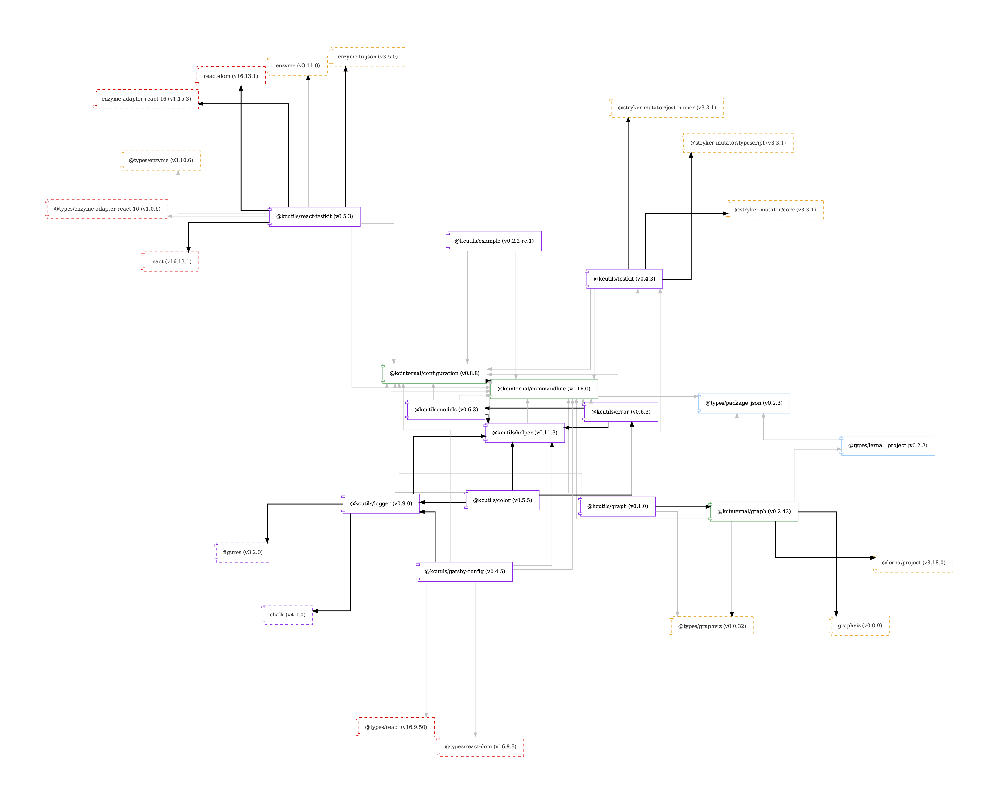

# KC Utils

This project is monorepository contains all utilities for all projects that generate from [monots](https://github.com/ktemplates/mono-ts) project.

## For End User

This repository contains 2 scope projects `@kcinternal` and `@kcutils`.

### @kcinternal

This is a internal projects which contains all internal tools like compiler, eslint configuration generic testkit. Published on [org/kcinternal](https://www.npmjs.com/org/kcinternal) on npm

1. [commandline](https://www.npmjs.com/package/@kcinternal/commandline) - contains useful commandline for monots projects. 
   - `icompiler-tsc` - for tsc compile without tsconfig file
   - `icompiler-webpack` - for webpack compile (use with @kcinternal/configuration package)
   - `icleaner [--all]` - for clean package results, includes log file, buildinfo, etc. This will log all files/folders that delete
   - `itester` - using jest to run test (use with @kcinternal/configution package)
   - `irunner [--index <filename>]` - using node to execute .js file. Default will find index.js file to custom pass `--index <filename>` to commandline
2. [configuration](https://www.npmjs.com/package/@kcinternal/configuration) - contains useful configuration for commandline and more
   1. `eslint` - support `node` and `react`
   2. `webpack` - support `node` and `react`
   3. `jest` - support `node` and `react`
3. [graph](https://www.npmjs.com/package/@kcinternal/graph) - for generate dependencies graph for monots projects
4. [react-testkit](https://www.npmjs.com/package/@kcinternal/react-testkit) - add support enzyme and other testkit for react

### @kcutils

THis is a utils projects for external projects to use

1. [error](https://www.npmjs.com/package/@kcutils/error) - contains error management and custom throwable
2. [logger](https://www.npmjs.com/package/@kcutils/logger) - another logger services
3. [helper](https://www.npmjs.com/package/@kcutils/helper) - for kcutils and might handle for external user as well

## For Contribution User

I create new mono repository for typescript projects. Which include `typescript`, `webpack` and `react`. For testing, I choose `jest` as testing framework. For linter, I choose `eslint` combine with `prettier`.

## How to use

1. choose technology that you want. [here](#technology)

## Create new package

you can copy code from _example package. Mainly you need `src` folder and `package.json` file. And we have some optional file you might want.

## Support tsc compiler

If you want use `icompiler-tsc` command. You just update build command on package.json and done.

## Support webpack compiler

If you want to use `icompiler-webpack` command. You have to add **webpack.config.js** and **tsconfig.json** file.

## Support linter and formatter

By default this have editorconfig file so for basic formatting like space, newline, final line it will support on most of text-editor. but for advance formatting like eslint and prettier, you have to add **.eslintrc.js** file

## Support testing

If you want to use `itester` command. You have to add **jest.config.js** file.

## Technology

1. CI/CD
   1. github workflow - for testing only
   2. circleci - for testing and deployment; Need more configuration on circleci side
2. Package management
   1. dependabot - for auto create and merge new package from package.json
3. Commit management
   1. gitgo - custom commit message which follow angular commit conversion
4. Code analytics
   1. sonar - for checking code smell and errors; Need more configuration on sonar side

